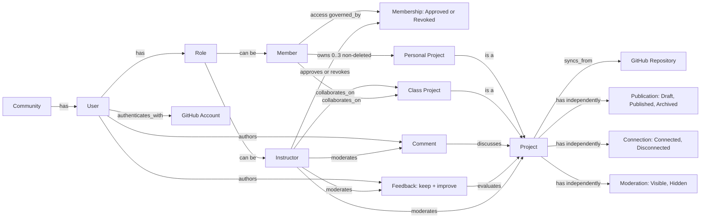

# Vibies Domain Model

[Documentation home](../README.md) · [Product definition](PRODUCT.md) ·
[Workflows](WORKFLOWS.md) · [Decisions](DECISIONS.md)

This document is the authoritative source for Vibies concepts, relationships,
constraints, and states. Other documents describe behavior by linking to these
terms instead of creating alternative definitions.

## People and access

| Term | Definition |
| --- | --- |
| **Community** | The private Vibies space built for exactly one Instructor and seven active Member places. A Member place may be temporarily vacant after access is revoked. |
| **User** | A person represented in Vibies. A User has one Role and is displayed only by a Nickname. Member access is governed by Membership; Instructor access is pre-established. |
| **Role** | One authorization category held by a User: Instructor or Member. |
| **Instructor** | The single User whose access is pre-established when the private Community is created. The Instructor authenticates with GitHub, approves or revokes Member Membership, and moderates Projects, Comments, and Feedback. “Moderator” describes this responsibility; it is not another Role. |
| **Member** | A User with the Member Role who owns Personal Projects and collaborates on the Class Project. An approved Member occupies one of seven active Member places. |
| **Former Member** | A User who retains the Member Role, project ownership, content authorship, and onboarding milestone after Membership is revoked, but has no Community access or owner-action permission. A Former Member does not occupy an active Member place. |
| **Membership** | Instructor-controlled Member access with `Approved` or `Revoked` status. Approval fills an available Member place and grants an authenticated Member access; revocation removes access and opens that place. Authentication alone is not Membership. |
| **GitHub Account** | The external identity used for authentication. Its username, avatar, and personal details are not displayed in Vibies. |
| **Nickname** | The only User identity displayed inside the Community. |
| **Onboarding completion** | The permanent Member milestone reached by publishing a first Personal Project. It gates Comments and Feedback, but not browsing. |

## Projects and repositories

| Term | Definition |
| --- | --- |
| **Project** | Work shared or developed in Vibies. A Project has independent publication, connection, and moderation states. |
| **Personal Project** | A Project owned by one Member and synchronized from that Member's selected private personal GitHub Repository. |
| **Class Project** | The separate organization-owned Project on which the Instructor and Members collaborate. It is not owned by a Member and does not count toward a Member's Personal Project limit. Its lifecycle authority is deliberately not assigned by Issue #6. |
| **GitHub Repository** | The external metadata source from which a Project is manually synchronized. |
| **GitHub App connection** | Authorization for metadata-only access to a selected GitHub Repository. It does not allow source-file or README-content importing. |
| **Manual sync** | An authorized User-requested refresh of repository metadata that records the time of the last completed sync. Personal Project sync authority belongs to its owner; Class Project sync authority is not yet assigned. |
| **Deletion** | Confirmed removal of a Personal Project, its imported metadata, discussion, and Feedback. Deletion is not a project state and is different from `Archived`, `Disconnected`, and `Hidden`. |

## Participation and moderation

| Term | Definition |
| --- | --- |
| **Comment** | A flat, User-authored discussion message about one Project. It is not a reply to another Comment. |
| **Feedback** | A structured, User-authored evaluation of one Project containing both a `keep` part and an `improve` part. |
| **Moderation** | Instructor-only hiding or restoration of a Project, Comment, or Feedback without changing its authored content. |

## Project state groups

Every Project has one value from each group. The groups are independent: changing
one value does not silently change either of the others.

| Group | Values | Meaning |
| --- | --- | --- |
| Publication | `Draft`, `Published`, `Archived` | `Draft` has not been published. `Published` is published to the Community when the other states allow it. `Archived` is retained but no longer active. Archived is not deleted. |
| GitHub connection | `Connected`, `Disconnected` | `Connected` has an active repository connection. `Disconnected` does not and makes the Project unavailable, without changing publication or moderation. |
| Moderation | `Visible`, `Hidden` | `Visible` is not suppressed by moderation. `Hidden` is suppressed by the Instructor until restored, without changing publication or connection. |

A Project is available to the Community exactly when it is `Published`,
`Connected`, and `Visible`. Availability is derived from the three state values;
it is not a fourth state.

## Relationships

- Community `has` User.
- User `has` Role: Instructor or Member.
- User `authenticates_with` GitHub Account.
- Member access is `governed_by` Membership.
- Instructor `approves_or_revokes` Membership.
- Member `owns` Personal Project.
- Instructor and Member `collaborate_on` Class Project.
- Project `syncs_from` GitHub Repository.
- User `authors` Comment.
- User `authors` Feedback.
- Comment `discusses` Project.
- Feedback `evaluates` Project.
- Instructor `moderates` Project, Comment, and Feedback.

## Constraints

- The Community has one Instructor and seven active Member places. Revocation
  may leave a place vacant until the Instructor approves a replacement.
- The Instructor cannot approve an eighth active Member. Revoking Membership
  creates a Former Member and removes access but does not itself delete, rewrite,
  or change the states of the User's existing Projects, Comments, or Feedback.
- A Former Member keeps the Member Role, ownership, authorship, and onboarding
  milestone but cannot access the Community or run owner workflows. Reapproval
  fills an available Member place and restores those permissions.
- Member access requires successful GitHub authentication and Instructor-approved
  Membership. Instructor access is pre-established separately and still requires
  GitHub authentication.
- Onboarding completion changes only once, when a Member first publishes a
  Personal Project. It remains complete afterward.
- A Member may browse before onboarding is complete but may not author Comments
  or Feedback.
- A Member may have at most three non-deleted Personal Projects.
- Every non-deleted Personal Project counts toward that maximum regardless of
  publication, connection, or moderation state.
- The Class Project does not count toward a Member's Personal Project maximum and
  cannot complete personal onboarding.
- A Member may run the documented Personal Project workflows only for their own
  Personal Projects.
- This foundation defines Comment and Feedback creation, but not individual edit
  or delete operations. If a future operation is accepted, it must respect the
  author-only boundary.
- A Comment targets a Project, never another Comment.
- Feedback always contains both `keep` and `improve`.
- A Member may comment on their own Personal Project but cannot submit Feedback
  on a Personal Project they own.
- The Instructor may hide and restore moderated content but cannot rewrite it.
- Repository synchronization is manual and metadata-only.
- Source files and README contents never enter Vibies.
- Only a Nickname is displayed as User identity.

## Mermaid graph

The diagram is a view of the definitions above, not a second source of terms.

The [product definition](PRODUCT.md) explains permissions and boundaries. The
[workflows](WORKFLOWS.md) explain how actors use these concepts, and the
[community rules](../RULES.md) define conduct.
